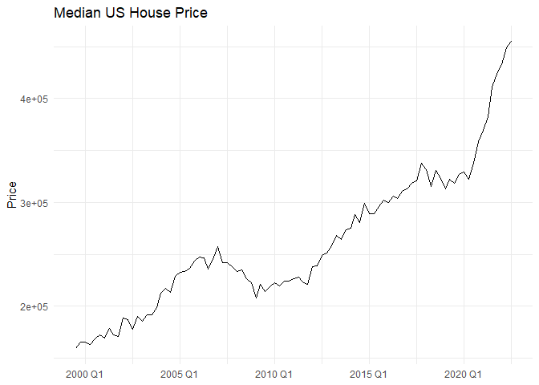
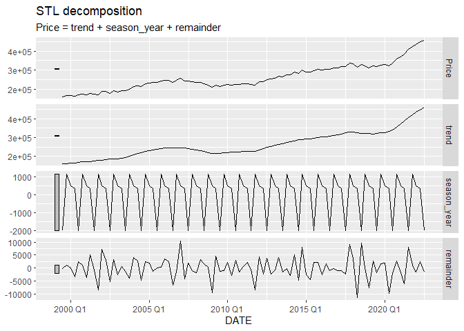
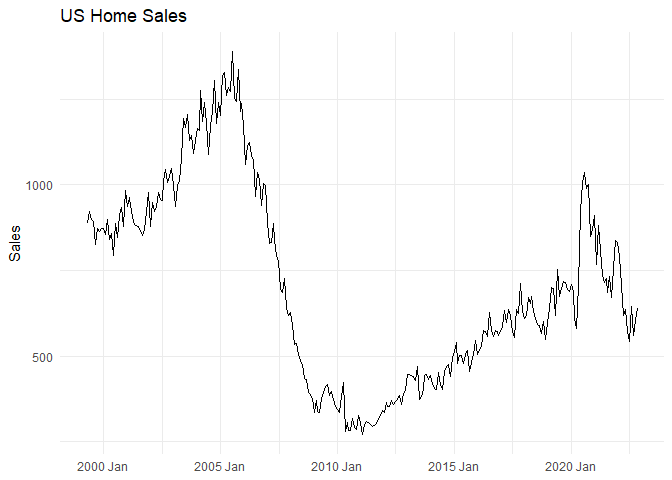
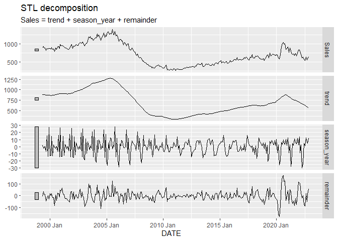

Time Series Analysis of Home Sales
================
Joshua Jaeger
2022-12-31

``` r
library(dplyr)
```

    ## Warning: package 'dplyr' was built under R version 4.1.3

    ## 
    ## Attaching package: 'dplyr'

    ## The following objects are masked from 'package:stats':
    ## 
    ##     filter, lag

    ## The following objects are masked from 'package:base':
    ## 
    ##     intersect, setdiff, setequal, union

``` r
library(tsibble)
```

    ## Warning: package 'tsibble' was built under R version 4.1.3

    ## 
    ## Attaching package: 'tsibble'

    ## The following objects are masked from 'package:base':
    ## 
    ##     intersect, setdiff, union

``` r
library(ggplot2)
```

    ## Warning: package 'ggplot2' was built under R version 4.1.3

``` r
library(lubridate)
```

    ## Warning: package 'lubridate' was built under R version 4.1.3

    ## Loading required package: timechange

    ## Warning: package 'timechange' was built under R version 4.1.3

    ## 
    ## Attaching package: 'lubridate'

    ## The following object is masked from 'package:tsibble':
    ## 
    ##     interval

    ## The following objects are masked from 'package:base':
    ## 
    ##     date, intersect, setdiff, union

``` r
library(tibble)
```

    ## Warning: package 'tibble' was built under R version 4.1.3

``` r
library(tsibbledata)
```

    ## Warning: package 'tsibbledata' was built under R version 4.1.3

``` r
library(feasts)
```

    ## Warning: package 'feasts' was built under R version 4.1.3

    ## Loading required package: fabletools

    ## Warning: package 'fabletools' was built under R version 4.1.3

``` r
library(fable)
```

    ## Warning: package 'fable' was built under R version 4.1.3

``` r
us_home_price <- read.csv("RawData/MSPUS.csv")
head(us_home_price)
```

    ##         DATE  MSPUS
    ## 1 1999-07-01 159100
    ## 2 1999-10-01 165300
    ## 3 2000-01-01 165300
    ## 4 2000-04-01 163200
    ## 5 2000-07-01 168800
    ## 6 2000-10-01 172900

``` r
us_home_price <- rename(us_home_price, Price = MSPUS)
```

``` r
us_home_price <- us_home_price %>%
  mutate(DATE = yearquarter(DATE)) %>%
  as_tsibble(index=DATE)
```

``` r
ggplot(us_home_price) +
  geom_line(aes(x=DATE, y=Price)) +
  labs(title = "Median US House Price", y= "Price", x=NULL) +
  theme_minimal()
```

<!-- -->

``` r
us_home_price %>%
  model(STL(Price ~
              trend() +
              season(window="periodic"))) %>%
  components() %>%
  autoplot()
```

<!-- -->

``` r
us_home_sales <- read.csv("RawData/HSN1F.csv") 
head(us_home_sales)
```

    ##         DATE HSN1F
    ## 1 1999-05-01   888
    ## 2 1999-06-01   923
    ## 3 1999-07-01   900
    ## 4 1999-08-01   893
    ## 5 1999-09-01   826
    ## 6 1999-10-01   872

``` r
us_home_sales <- us_home_sales %>%
  rename(Sales = HSN1F) %>%
  mutate(DATE = yearmonth(DATE)) %>%
  as_tsibble(index=DATE)
```

``` r
autoplot(us_home_sales,Sales) +
  theme_minimal() +
  labs(title = "US Home Sales", x=NULL)
```

<!-- -->

``` r
us_home_sales %>%
  model(
    STL(Sales ~ 
          trend() +
          season())) %>%
  components() %>%
  autoplot() 
```

<!-- -->
